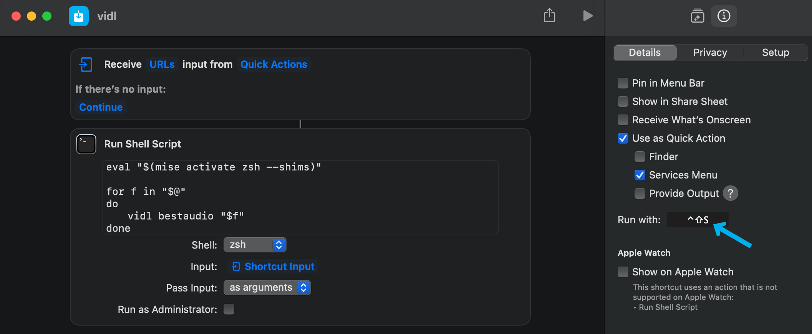

<p align="center">
  
</p>

# vidl
vidl is a script designed to easily download video/audio from anywere, using yt-dlp. It automatically embeds thumbnails to mp3/mp4/m4a files.

vidl will add metadata to mp3 files if it's found. The `--no-md` option turns this off.
`title`, `artist` and `year` metadata is added, but if the URL is a playlist, it also adds `album`, `album artist`, `track number`, `track count`.
If the title contains " - ", vidl often uses what comes before and after it as artist and title respectively. The `--dont-extract-md` option turns off this behaviour.

# Installation
1. Install Python (3.7+ is recommended)
2. Install [ffmpeg and ffprobe](https://www.ffmpeg.org/)
3. Run `pip3 install vidl`.
4. If you're not on macOS or Windows, you need to specify where vidl will download files to in your vidl config file. Run `vidl --config-path` to see where the config file is.
If you're on macOS, I recommend [setting up shortcuts for vidl](#macos-shortcut-setup)

# Updating
vidl is updated by running `pip3 install vidl --upgrade --upgrade-strategy eager`.
If vidl is unable to download a URL, it might be because yt-dlp is outdated. The `--upgrade-strategy eager` part updates yt-dlp.

# Uninstall
Run `pip3 uninstall vidl`.

To fully uninstall vidl, go to vidl's config file (Run `vidl --config-path` to see where it is) and delete the folder it's in.

# Usage
Examples:
`vidl https://www.youtube.com/watch?v=ta_ZVS7HkwI`
- Downloads the video as mp3, and adds metadata it detects.

`vidl mp3 https://www.youtube.com/watch?v=ta_ZVS7HkwI --no-md`
- Downloads the video as mp3, without adding metadata.

`vidl`
- Prints vidl's help menu, which looks like this:
    ```
    Download Usage:
        vidl [format] [options] <URL>

    Download Options:
        format             bestvideo, bestaudio (default), mp3, mp4, wav, m4a, or opus
        --no-md            Don't add metadata to downloaded files
        --no-smart-md      Don't extract artist and song name from title
        --no-embed         Don't embed thumbnail
        --no-dl            Don't download anything. Usually used with -v
        -v, --verbose      Display all logs

    General Options:
        --version          Show version. vidl -v and vidl version works too
        -h, --help         Show this help message. vidl help works too
        --config-path      Show the location of the configuration file

    Update:
        pip3 install vidl --upgrade --upgrade-strategy eager
    ```

# Configuration
vidl has a configuration file, which you can find the location of by running `vidl --config-path`. In it, you can set the download folder and filename template.

If you screw something up, you can delete the file, and the default will be recreated the next time you run vidl.

# Custom metadata parsing

vidl has a `user_md_parser.py` file. By default, it does nothing, but you can configure it to manipulate metadata of songs you download however you like. In my case, I set the "Comment" metadata to "NCS" if the title ends with "[NCS Release]".

Documentation for this can be found in the file itself. The file is in the same folder as vidl's config file, which you can find by by running `vidl --config-path`. If you screw something up, you can delete the file, and the default will be recreated the next time you run vidl.

# <a name="macos-shortcut-setup"></a>Set up shortcuts for vidl (macOS)

Download [the vidl.shortcut file](./vidl.shortcut) or try [this link](https://www.icloud.com/shortcuts/b84b48ed62ec426398c43daf0d695408). You'll be able to select any piece of text, press your chosen shortcut and the link(s) in your selected text will be downloaded!

You can set your preferred keyboard shortcut here:


# API Usage
You can use Python to download a URL. Example:
```python
from vidl import config, dl

def main():
    config.verify_config()
    dl.download({
        # all options are required
        'url': 'https://www.youtube.com/watch?v=82IZ63TU8Fs'
        'file_format': 'mp3',
        'audio_only': True,
        'no_md': False,
        'no_thumbnail_embed': False,
        'no_smart_md': False,
        'no_dl': False,
        'verbose': False,
        'download_folder': config.get_config('download_folder'),
        'output_template': config.get_config('output_template'),
    })
main()
```

# Dev Instructions

## Dev Installation
1. Install Python. You may want to install it using [pyenv](https://github.com/pyenv/pyenv) in order to manage Python versions (If Poetry doesn't detect the right version, you can fix it with pyenv).
2. Install [ffmpeg and ffprobe](https://www.ffmpeg.org/)
3. Install [Poetry](https://poetry.eustace.io)
4. Run `poetry install` to install Python package dependencies.
5. If you're not on macOS or Windows, you need to specify where vidl will download files to in your vidl config file. Run `vidl --config-path` to see where the config file is.

I recommend running `poetry config virtualenvs.in-project true`, which makes Poetry store your Python virtual environment inside the project folder. Additionally, it lets VSCode's Python extension detect the virtual environment if you set the `python.pythonPath` setting to `${workspaceFolder}/.venv/bin/python` in your settings.

## Running
```
poetry run vidl
```

An alternative to `poetry run <command>` is to run `poetry shell` to enter the virtual environment's Bash CLI, and then run the command on it's own (e.g `vidl`).

## Releasing a new version

First of all, consider updating the lockfile dependencies by running `poetry update`, then check if things still work.

1. Bump the version number. `<version>` can be `patch`, `minor`, `major` or a version number:
    ```
    poetry version <version>
    ```
2. Update CHANGELOG.md
3. Build:
    ```
    poetry build
    ```
4. Commit and create a git tag
5. Create GitHub release with release notes and attach the build files
6. Publish to PyPI:
    ```
    poetry publish
    ```
